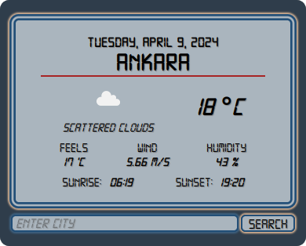

# A Weather Component

Simple weather app made with JavaScript to show the weather conditions from the browser location or in the desired location.

The design is inspired from old digital watches *like Casio FW-91W*.

There is also pure JS version of it, which can be found at my other repo [weather_app](https://github.com/bakankaya/weather_app).

To use you need to get your own API keys from listed services (*for free*).

---
Used Sources:

- Weather information is from [OpenWeather](https://openweathermap.org/api).

- Automatic location finding is made with [Geoapify](https://www.geoapify.com/).

- The font is [Digital-7](https://www.1001fonts.com/digital-7-font.html) By Style-7 from [1001fonts](https://www.1001fonts.com/users/style-7/).

- Favicon is [Clouds](https://icons8.com/icon/QdG76489aLZo/clouds) icon from [Icons8](https://icons8.com).